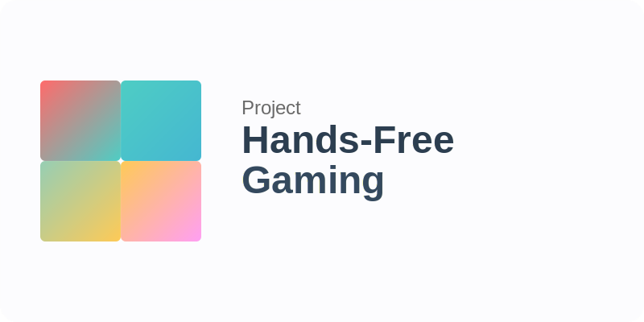

# Hand Gesture Recognition System


> **Research Objective**: Investigating the feasibility of single-hand gesture-based gaming controls without physical input devices.

A Hand For A Game is an experimental computer vision system that enables real-time hand gesture recognition for gaming applications. The system utilizes MediaPipe for hand landmark detection and implements custom gesture interpretation algorithms.

> [!WARNING]
> This is a research prototype with author-specific calibrations. It is not intended for general accessibility use or production deployment.

> [!NOTE]
> The system is optimized for the original author's hand anatomy and hardware configuration. Performance and accuracy may vary significantly with different users or setups.

## Quick Start

### Prerequisites

Before installation, ensure you have the required environment. See [Environment Setup Guide](docs/ENVIRONMENT_SETUP.md) for detailed requirements.

> [!IMPORTANT]
> - Python 3.9+ (3.11 recommended)
> - C++ compiler (MinGW-w64 or Visual Studio Build Tools for Windows)
> - Camera/webcam access
> - System libraries and dependencies

### Installation

```bash
# Clone the repository
git clone https://github.com/stdnt-c1/A-Hand-For-A-Game.git
cd A-Hand-For-A-Game

# Install Python dependencies
pip install -r requirements.txt

# Build C++ extensions (optional, provides 75% performance improvement)
scripts\build_dll.bat    # Windows
./scripts/build_dll.sh   # Linux/macOS

# Verify installation
python tests/test_imports.py
```

### Running the Application

```bash
# Start the main application
python hand_control.py

# Run performance validation
python tests/test_performance.py
```

> [!TIP]
> Use the C++ extensions for optimal performance. The system automatically falls back to Python-only mode if extensions are unavailable.

## Project Structure

```
AzimuthControl/
├── src/                           # Source code
│   ├── core/                      # Core gesture recognition
│   │   ├── gesture_definitions.py # Gesture validation functions
│   │   ├── gesture_determinator.py# Gesture detection algorithms
│   │   ├── central_linker.py      # Main coordination system
│   │   └── config_manager.py      # Configuration management
│   ├── controls/                  # Control implementations
│   │   ├── action_control.py      # Combat and interaction
│   │   ├── movement_control.py    # Character movement
│   │   ├── camera_control.py      # Camera control
│   │   └── navigation_control.py  # UI navigation
│   ├── utils/                     # Utility functions
│   │   ├── geometry_utils.py      # Mathematical calculations
│   │   ├── visualizer.py         # Debug visualization
│   │   └── validator.py          # Input validation
│   └── performance/               # Performance optimization
│       ├── optimized_engine.py   # High-performance engine
│       ├── optimizer.py          # Adaptive performance tuning
│       └── monitor.py            # Performance monitoring
├── config/                        # Configuration files
├── tests/                         # Test suite
├── docs/                          # Documentation
├── resBalancer/                   # C++ performance extensions
└── hand_control.py               # Main application entry point
```

## Gesture Controls

> [!NOTE]
> All gesture definitions are calibrated specifically for the original author's hand anatomy. Accuracy may vary with different users.

### Movement Control
- **Fist Neutral**: No movement
- **Thumbs Out Left**: Move left (A key)
- **Pinky Out Right**: Move right (D key)
- **Index Curled Shift**: Shift modifier
- **Jump Space**: Jump (Space key)

### Action Control
- **Palm Neutral**: No action
- **Attack LMB**: Left mouse click
- **Skill E**: E key activation
- **Skill R**: R key activation
- **Skill Q**: Q key activation
- **Utility T**: T key activation

### Camera Control
- **Camera Neutral**: Ring and Pinky curled
- **Pan Control**: 3-axis camera movement

### Navigation Control
- **Peace Sign Enter**: Enter key
- **Thumbs Down Esc**: Escape key
- **Tilted Peace F**: F key activation

## Configuration

The system uses centralized configuration in `config/controls.json`:

```json
{
  "gesture_controls": {
    "MovementControl": { "enabled": true, "gestures": [...] },
    "ActionControl": { "enabled": true, "gestures": [...] }
  },
  "performance_settings": {
    "target_fps": 30,
    "enable_caching": true,
    "cache_duration_ms": 100
  },
  "system_settings": {
    "camera_index": 0,
    "window_width": 1280,
    "window_height": 720
  }
}
```

## Performance Features

- **Adaptive Frame Rate**: Automatically adjusts between 15-30 FPS based on system load
- **Gesture Caching**: 100ms result caching to reduce computation overhead
- **JIT Compilation**: Numba-optimized geometric calculations
- **C++ Extensions**: Critical path calculations in optimized C++
- **Stability Filtering**: Reduces gesture flickering with multi-frame confirmation

> [!TIP]
> Enable C++ extensions for 75% performance improvement over Python-only mode.

## Testing

Run the comprehensive test suite:

```bash
python -m pytest tests/test_gesture_system.py -v
```

Test coverage includes:
- Gesture compatibility validation
- Performance benchmarks
- Import verification
- Edge case handling

## System Requirements

### Minimum Requirements
- **OS**: Windows 10, Ubuntu 20.04+, or macOS 11+
- **Python**: 3.9+ (3.11 recommended)
- **RAM**: 8GB
- **Camera**: USB webcam or integrated camera (720p+)
- **Storage**: 2GB free space

### Recommended Requirements
- **OS**: Windows 11 or Ubuntu 22.04+
- **Python**: 3.11
- **RAM**: 16GB
- **CPU**: Intel i5/AMD Ryzen 5 or better
- **Camera**: 1080p webcam with good lighting

### External Dependencies
- **C++ Compiler**: MinGW-w64, Visual Studio Build Tools, or GCC 9+
- **System Libraries**: Camera drivers, OpenCV system libraries
- **Optional**: CUDA toolkit for GPU acceleration

> [!IMPORTANT]
> See [Environment Setup Guide](docs/ENVIRONMENT_SETUP.md) for complete setup instructions and [Dependencies Documentation](docs/DEPENDENCIES.md) for detailed dependency information.

## Performance Monitoring

The system includes built-in performance monitoring:
- Real-time FPS tracking
- CPU/GPU usage monitoring
- Gesture processing latency measurement
- Memory usage statistics

## Development

### Adding New Gestures

1. Add gesture definition to `src/core/gesture_definitions.py`
2. Update configuration in `config/controls.json`
3. Add detection logic to `src/core/gesture_determinator.py`
4. Write tests in `tests/test_gesture_system.py`

### Performance Optimization

- Use Numba `@jit` decorators for computational functions
- Implement result caching for expensive operations
- Monitor performance with built-in profiling tools
- Consider C++ extensions for critical performance paths

## Contributing

> [!IMPORTANT]
> A Hand For A Game is currently a personal research project with author-specific calibrations. We are not accepting direct code contributions at this time.

We welcome community input through:
- **Suggestions and feedback** via GitHub Issues
- **Research collaboration** discussions
- **Documentation improvements** recommendations
- **Bug reports** and system feedback

For detailed contribution guidelines, please read our [Contributing Guide](CONTRIBUTING.md).

### Quick Guidelines

- Submit suggestions through GitHub Issues
- Maintain professional and constructive communication
- Focus on actionable, technically feasible improvements
- Respect the project's research-focused scope

## Documentation

Comprehensive documentation is available in the `/docs` directory:

- **[Architecture Guide](docs/ARCHITECTURE_GUIDE.md)**: System design and component overview
- **[Environment Setup](docs/ENVIRONMENT_SETUP.md)**: Development environment configuration
- **[Performance Guide](docs/PERFORMANCE_GUIDE.md)**: Optimization strategies and benchmarks
- **[Controls Documentation](docs/CONTROLS_README.md)**: Gesture definitions and configurations
- **[Dependencies](docs/DEPENDENCIES.md)**: Package requirements and installation

## License

This project is licensed under the GNU Affero General Public License v3.0 (AGPL-3.0). See the LICENSE file for details.
