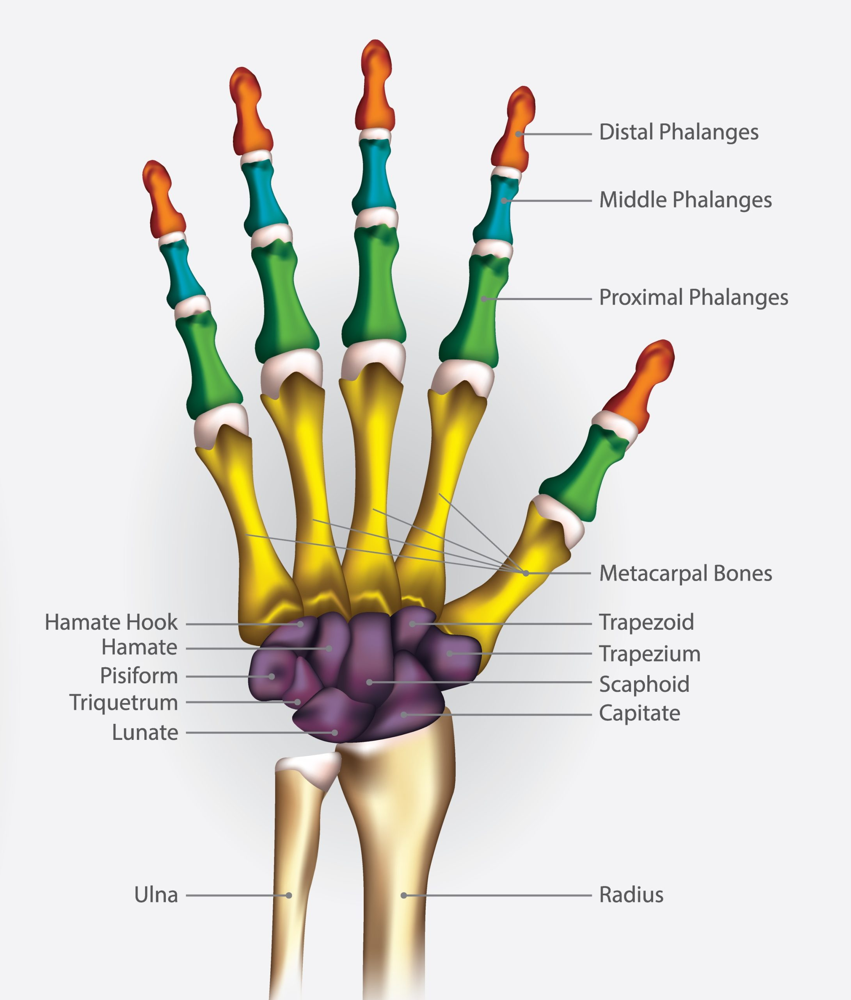
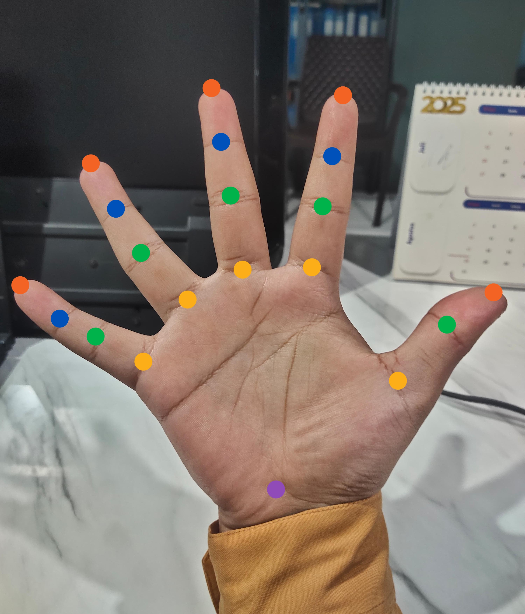
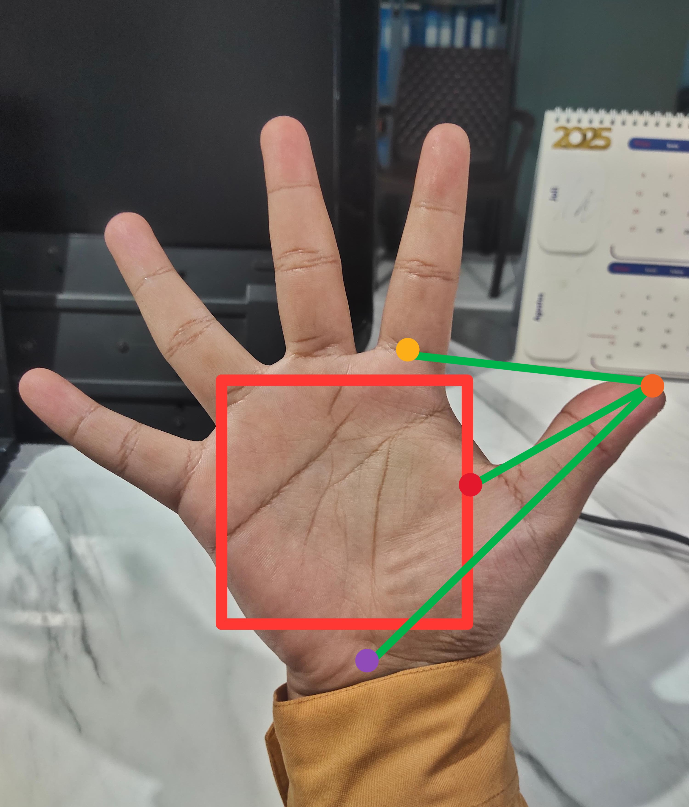
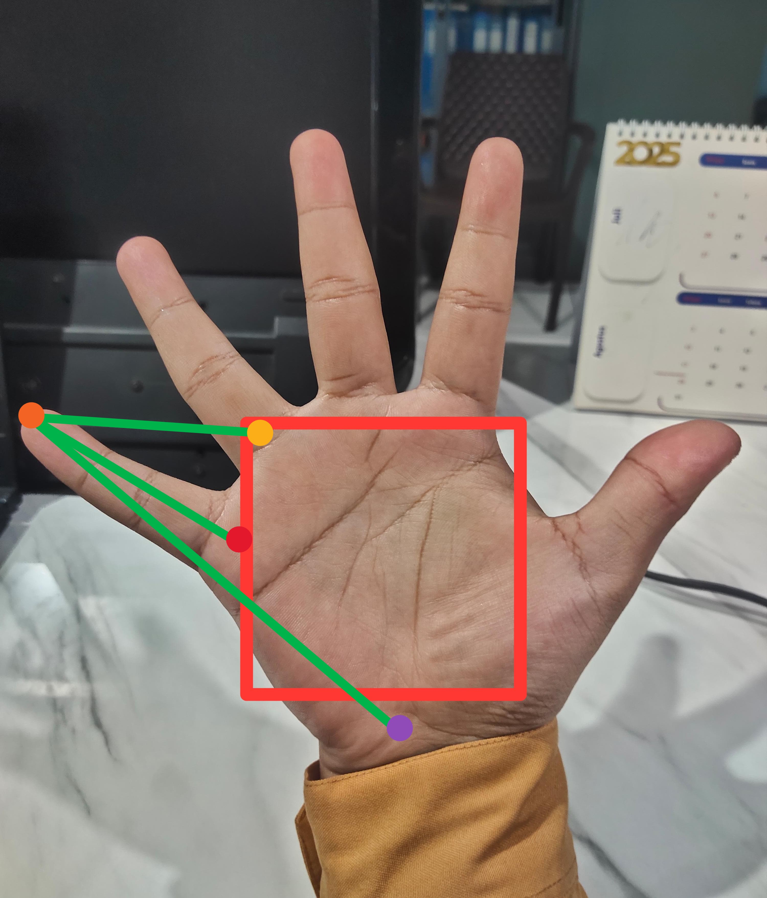
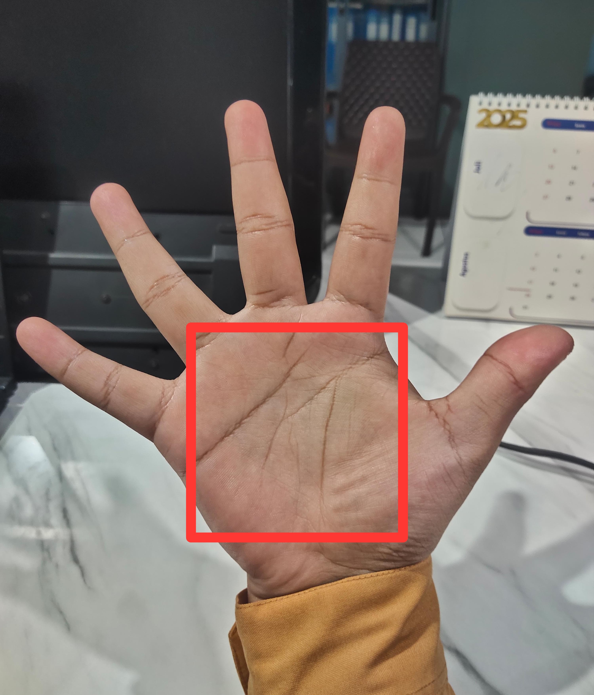
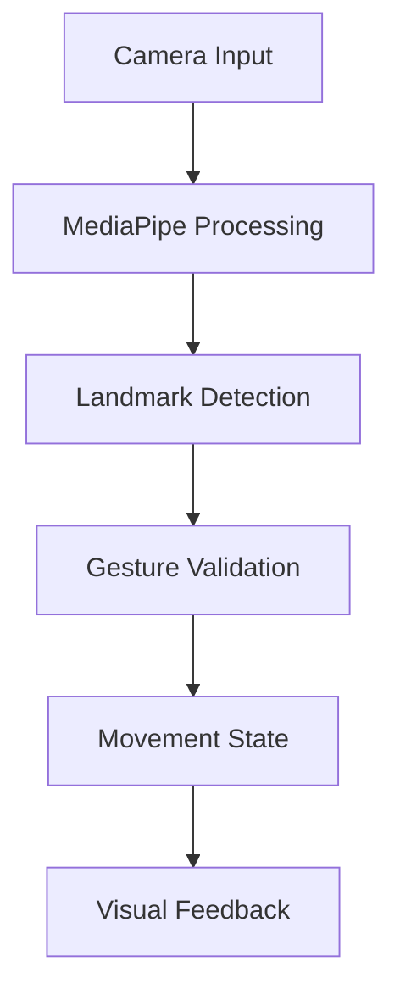
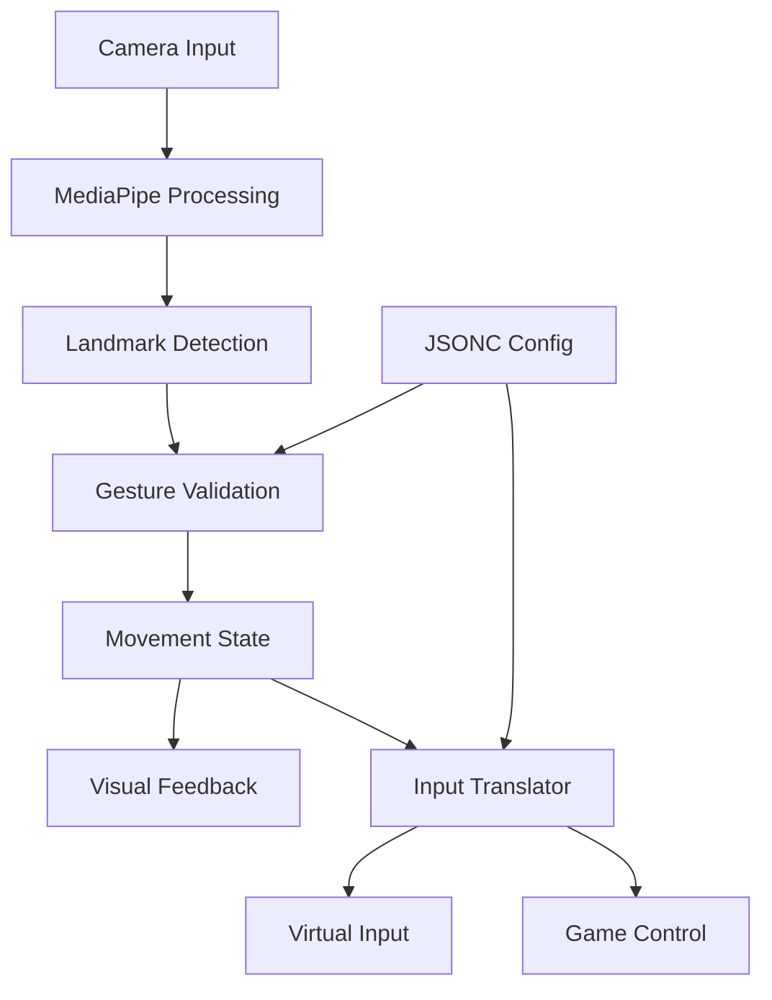

# 🎮 3D Game Control Through Hand Gestures

<div align="center">
  
  <p><em>Hand anatomical reference showing key bone structures and joints</em></p>
</div>

## 🎯 Objective
*"Can I play a game with just a single palm without touching anything physically?"*

This project explores the possibility of controlling 3D game movements using only hand gestures captured through a webcam, without the need for physical input devices. The goal is to create an intuitive and responsive control system that translates natural hand movements and gestures into game controls.

## 📝 Project Status

<div style="background-color: #e6f3ff; padding: 15px; border-radius: 5px; border-left: 5px solid #b8daff;">
<strong>Development Stage:</strong><br>
This is currently a proof-of-concept implementation focusing on gesture detection accuracy and validation. The project aims to verify:

1. Reliable hand landmark detection
2. Accurate gesture recognition
3. Consistent movement interpretation
4. Real-time performance viability
5. Multi-axis control feasibility

Further development and refinement will be needed for production use.
</div>

## 🔍 Technical Overview

### Core Detection System
The system employs a multi-layered approach to ensure reliable gesture detection:

1. **Base Detection Layer**
   - MediaPipe hand landmark detection
   - 21-point hand skeleton mapping
   - Real-time position tracking
   - 3D spatial coordinate system

2. **Data Processing Layer**
   - Smoothing algorithms for jitter reduction
   - Moving average for stable tracking
   - Normalized coordinate system
   - Spatial relationship analysis

3. **Validation Layer**
   - Three-point triangle validation
   - Bounding box spatial reference
   - Anatomical constraint checking
   - Gesture state verification

## 🛠️ Technical Implementation

### Hand Tracking Foundation
- **Framework**: MediaPipe Hand Tracking
- **Vision Processing**: OpenCV
- **Performance Optimization**: 
  - MSMF backend with DX11 for Windows
  - Smoothing algorithms for stable tracking
  - Efficient frame processing

### Anatomical Reference System
<div align="center">
  
  <p><em>Hand landmarks color-coded by joint type:</em></p>
  <ul style="list-style: none;">
    <li>🟣 Purple - Wrist</li>
    <li>🟡 Yellow - Metacarpal joints</li>
    <li>🟢 Green - Proximal phalanges</li>
    <li>🔵 Blue - Middle phalanges</li>
    <li>🟠 Orange - Distal phalanges</li>
  </ul>
</div>

### Three-Point Validation System
<div align="center">
  
  
  <p><em>Triangle-based gesture validation system showing reference points and distances</em></p>
</div>

The validation system uses three reference points to ensure reliable gesture detection:
1. Joint anchor point (metacarpal)
2. Wrist reference point
3. Bounding box perimeter point

<div align="center">
  
  <p><em>Palm bounding box used for spatial reference and gesture validation</em></p>
</div>

### Control System
Current implementation supports simultaneous multi-axis control:

#### Movement Controls
- **Forward/Backward**: Core finger fist + hand distance
  - 🤜 Closer = FORWARD
  - 🤛 Further = BACKWARD
- **Left/Right**: Independent thumb/pinky extension
  - 👍 Thumb out = LEFT
  - 🤙 Pinky out = RIGHT

#### Visual Feedback
- Real-time validation visualization
- Green lines indicate valid gestures
- Red lines indicate invalid gestures
- Status display showing current movement state
- Performance metrics (FPS, CPU, Memory usage)

> ## ⚠️ Important Notes
>
> <div style="background-color: #fff3cd; padding: 15px; border-radius: 5px; border-left: 5px solid #ffeeba;">
> <strong>Accessibility Disclaimer:</strong><br>
> This control system was developed based on personal experimentation and specific hand movement preferences. While it demonstrates the potential for touchless control systems, it may not be universally suitable for people with different physical abilities or movement patterns. Further adjustments and customization options would be needed for broader accessibility support.
> </div>

## 🛣️ Roadmap

### Planned Features
1. **Advanced Movement**
   - [ ] Run/Dodge functionality (Shift equivalent)
   - [ ] Sprint toggle mechanism

2. **Camera Controls**
   - [ ] Camera panning
   - [ ] Zoom in/out
   - [ ] Camera rotation

3. **Action Inputs**
   - [ ] Basic attack mechanism
   - [ ] Skill activation gestures
   - [ ] Utility/Item usage controls

4. **System Improvements**
   - [ ] Gesture customization interface
   - [ ] Sensitivity adjustment options
   - [ ] Calibration presets
   - [ ] Alternative gesture sets for accessibility

5. **Configuration System**
   - [ ] JSONC-based configuration system
     ```jsonc
     {
       // Input mapping configuration
       "gestures": {
         "fist": {
           "type": "compound",
           "definition": {
             "core_fingers": "curled",
             "thumb": "any",
             "pinky": "any"
           },
           // Multiple possible mappings
           "mappings": [
             {
               "condition": "distance > threshold",
               "output": "FORWARD"
             },
             {
               "condition": "distance < threshold",
               "output": "BACKWARD"
             }
           ]
         },
         "thumb_out": {
           "type": "single",
           "validation": "triangle",
           "points": ["thumb_tip", "index_mcp", "wrist"],
           "output": "LEFT"
         }
       },
       // Advanced settings
       "settings": {
         "smoothing_factor": 3,
         "detection_confidence": 0.8,
         "validation_thresholds": {
           "distance_multiplier": 0.6,
           "angle_tolerance": 15
         }
       }
     }
     ```
   - [ ] Custom gesture definition support
   - [ ] Input translation configuration
   - [ ] Validation parameters adjustment

6. **Control Implementation**
   - [ ] Separate input translation module
   - [ ] Key mapping system
   - [ ] Virtual input simulation
   - [ ] Game-specific profiles

## 💡 Implementation Notes

### Current Architecture


### Planned Architecture


## 🔧 Technical Requirements

- Python 3.8+
- OpenCV
- MediaPipe
- NumPy
- psutil

## 🚀 Getting Started

1. Install dependencies:
```bash
pip install -r requirements.txt
```

2. Run the control system:
```bash
python hand_control.py
```

3. Calibration:
   - Position your hand in neutral pose
   - Make a fist with core fingers
   - Press 'C' to calibrate
   - System is ready for input

## 📈 Performance Considerations

### Environmental Factors
- **Lighting**
  - Consistent, well-lit environment
  - Avoid strong backlighting
  - Minimize rapid light changes
  
- **Camera Setup**
  - Clean lens for clear capture
  - Stable mounting/positioning
  - Recommended 60 FPS capture
  - Minimum 720p resolution

### Usage Optimization
- **Hand Positioning**
  - Keep within optimal detection zone (0.5-1m from camera)
  - Maintain clear line of sight
  - Avoid extreme angles
  
- **Movement Patterns**
  - Smooth, deliberate gestures
  - Controlled transition speeds
  - Maintain consistent hand orientation
  - Allow brief pauses between complex gestures

### System Performance
- **Resource Usage**
  - Monitor CPU utilization
  - Track frame processing time
  - Observe memory consumption
  - Adjust quality settings if needed

### Known Limitations
- Gesture detection may be affected by:
  - Rapid lighting changes
  - Complex backgrounds
  - Multiple moving objects
  - Extreme hand rotations
  - Very fast movements

## 🔬 Future Research Areas

1. **Advanced Gesture Recognition**
   - Machine learning enhancement
   - Pattern-based prediction
   - Adaptive calibration

2. **Performance Optimization**
   - GPU acceleration
   - Parallel processing
   - Memory optimization

3. **User Experience**
   - Fatigue reduction
   - Gesture ergonomics
   - Accessibility options
