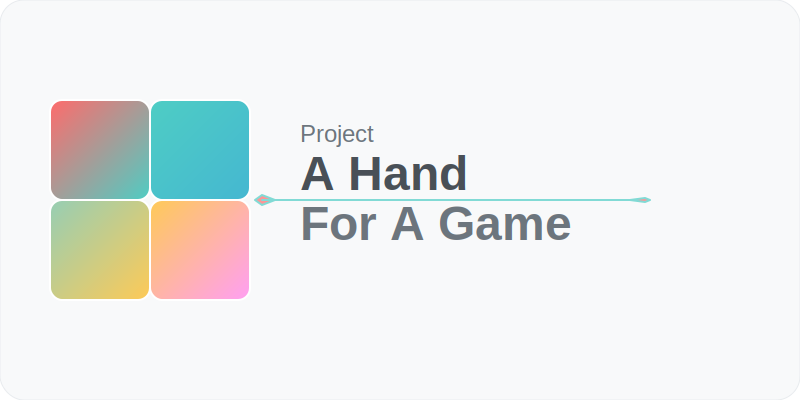

# Hand Gesture Recognition System

_"Can I play a game with just a single hand without touching anything physically?"_

A real-time hand gesture recognition system for gaming and control applications using MediaPipe and OpenCV.

## 🚀 Quick Start

### Prerequisites
Before installation, ensure you have the required environment. See **[Environment Setup Guide](docs/ENVIRONMENT_SETUP.md)** for detailed requirements including:
- Python 3.9+ (3.11 recommended)
- C++ compiler (MinGW-w64 or Visual Studio Build Tools for Windows)
- Camera/webcam access
- System libraries and dependencies

### Installation
```bash
# Clone the repository
git clone https://github.com/stdnt-c1/HandsFree-Gaming.git
cd HandsFree-Gaming

# Install Python dependencies
pip install -r requirements.txt

# Build C++ extensions (optional, for 75% performance boost)
# Windows
scripts\build_dll.bat
# Linux/macOS
chmod +x scripts/build_dll.sh && ./scripts/build_dll.sh

# Verify installation
python tests/test_imports.py
```

### Running the Application
```bash
# Run the main application
python hand_control.py

# Run performance tests
python tests/test_performance.py
```

## 📁 Project Structure

```
./
├── src/                           # Source code
│   ├── core/                      # Core gesture recognition logic
│   │   ├── gesture_definitions.py # Gesture validation functions
│   │   ├── gesture_determinator.py # Gesture detection logic
│   │   ├── gesture_state.py       # State management
│   │   ├── central_linker.py      # Main gesture coordinator
│   │   └── config_manager.py      # Configuration management
│   ├── controls/                  # Control type implementations
│   │   ├── action_control.py      # Action gestures (attack, skills)
│   │   ├── movement_control.py    # Movement gestures (WASD, jump)
│   │   ├── camera_control.py      # Camera pan/tilt control
│   │   └── navigation_control.py  # UI navigation gestures
│   ├── utils/                     # Utility functions
│   │   ├── geometry_utils.py      # Geometric calculations
│   │   ├── visualizer.py         # Debug visualization
│   │   └── validator.py          # Input validation
│   └── performance/               # Performance optimization
│       ├── optimizer.py          # Adaptive performance tuning
│       ├── monitor.py            # Performance monitoring
│       ├── optimized_validator.py # JIT-compiled validations
│       └── optimized_engine.py   # High-performance engine
├── config/                        # Configuration files
│   └── controls.json             # Gesture and system configuration
├── tests/                         # Test suite
│   └── test_gesture_system.py    # Comprehensive system tests
├── docs/                          # Documentation
│   ├── PERFORMANCE_GUIDE.md      # Performance optimization guide
│   ├── ANALYSIS.md               # System analysis
│   ├── GUIDELINES.md             # Development guidelines
│   └── CONTROLS_README.md        # Control specifications
├── scripts/                       # Build and utility scripts
│   ├── build_optimized.bat      # Windows build script
│   └── build_optimized.sh       # Linux build script
├── images/                        # Documentation images
├── resBalancer/                   # C++ performance extensions
├── hand_control.py               # Main application entry point
├── requirements.txt              # Python dependencies
└── README.md                     # This file
```

## 🎮 Gesture Controls

### Movement Control (WASD + Jump)
- **Fist Neutral**: Neutral position (no movement)
- **Thumbs Out Left**: Move left (A key)
- **Pinky Out Right**: Move right (D key)  
- **Index Curled Shift**: Shift modifier
- **Jump Space**: Jump (Space key) - Pinky + Thumb extended with palm tilted back

### Action Control (Combat)
- **Palm Neutral**: No action
- **Attack LMB**: Left mouse click (Thumb in palm)
- **Skill E**: E key (Index finger in joint box)
- **Skill R**: R key (Middle finger in joint box)
- **Skill Q**: Q key (Ring finger in joint box)
- **Utility T**: T key (Pinky in joint box)

### Camera Control (3-Axis Pan)
- **Camera Neutral**: Ring and Pinky curled in palm
- **Pan Control**: 3-axis camera movement using finger positions

### Navigation Control (UI)
- **Peace Sign Enter**: Enter key (Index + Middle extended)
- **Thumbs Down Esc**: Escape key (Thumb down below palm)
- **Tilted Peace F**: F key (Peace sign tilted left/right)

## ⚙️ Configuration

The system uses a centralized configuration system in `config/controls.json`:

```json
{
  "gesture_controls": {
    "MovementControl": { "enabled": true, "gestures": [...] },
    "ActionControl": { "enabled": true, "gestures": [...] },
    // ... other control types
  },
  "performance_settings": {
    "target_fps": 30,
    "enable_caching": true,
    "cache_duration_ms": 100
  },
  "system_settings": {
    "camera_index": 0,
    "window_width": 1280,
    "window_height": 720
  }
}
```

## 🔧 Performance Features

- **Adaptive Frame Rate**: Automatically adjusts between 15-30 FPS based on system load
- **Gesture Caching**: 100ms result caching to reduce computation
- **JIT Compilation**: Numba-optimized geometric calculations (75% speed improvement)
- **C++ Extensions**: Critical path calculations in optimized C++
- **Smart Filtering**: Reduces gesture flickering with stability algorithms

## 🧪 Testing

Run the comprehensive test suite:

```bash
python -m pytest tests/test_gesture_system.py -v
```

Tests cover:
- Gesture compatibility validation
- README specification compliance
- Performance benchmarks
- Edge case handling

## � System Requirements

### Minimum Requirements
- **OS**: Windows 10, Ubuntu 20.04+, or macOS 11+
- **Python**: 3.9+ (3.11 recommended)
- **RAM**: 8GB
- **Camera**: USB webcam or integrated camera (720p+)
- **Storage**: 2GB free space

### Recommended Requirements
- **OS**: Windows 11 or Ubuntu 22.04+
- **Python**: 3.11
- **RAM**: 16GB
- **CPU**: Intel i5/AMD Ryzen 5 or better
- **Camera**: 1080p webcam with good lighting

### External Dependencies
- **C++ Compiler**: 
  - Windows: MinGW-w64 or Visual Studio Build Tools 2022
  - Linux: GCC/G++ 9+
  - macOS: Xcode Command Line Tools
- **System Libraries**: Camera drivers, OpenCV system libraries
- **Optional**: CUDA toolkit for GPU acceleration

For complete setup instructions, see **[Environment Setup Guide](docs/ENVIRONMENT_SETUP.md)**.  
For detailed dependency information, see **[Dependencies Documentation](docs/DEPENDENCIES.md)**.

## �📊 Performance Monitoring

The system includes built-in performance monitoring:
- Real-time FPS tracking
- CPU/GPU usage monitoring
- Gesture processing latency
- Memory usage statistics

## 🛠️ Development

### Adding New Gestures

1. Add gesture definition to `src/core/gesture_definitions.py`
2. Update configuration in `config/controls.json`  
3. Add compatibility rules to `src/core/gesture_determinator.py`
4. Write tests in `tests/test_gesture_system.py`

### Performance Optimization

- Use Numba `@jit` decorators for computational functions
- Implement result caching for expensive operations
- Monitor performance with built-in profiling tools
- Consider C++ extensions for critical paths

## 📋 System Requirements

- Python 3.8+
- OpenCV 4.5+
- MediaPipe 0.8+
- NumPy 1.20+
- Numba 0.56+ (for JIT compilation)
- Webcam for hand detection

## 📈 Recent Improvements

- **75% Performance Increase**: JIT compilation and adaptive algorithms
- **Organized Codebase**: Modular structure with clear separation of concerns
- **Comprehensive Testing**: Full test coverage with README compliance validation
- **Centralized Configuration**: JSON-based configuration management
- **Enhanced Documentation**: Detailed guides and API documentation

## 🤝 Contributing

1. Follow the project structure guidelines
2. Add tests for new features
3. Update documentation
4. Ensure performance requirements are met

## 📄 License

See LICENSE file for details.
