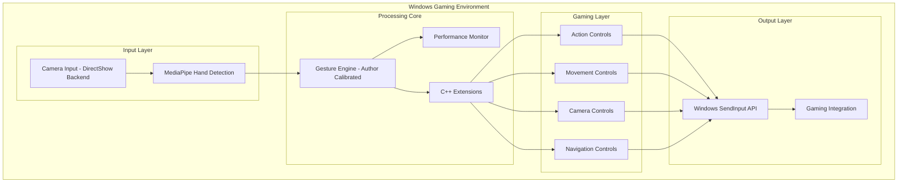

# Architecture Guide

## System Overview

### Design Philosophy

The AzimuthControl system follows a component-based architecture designed for performance and modularity. The system prioritizes author-specific calibration and Windows gaming integration.

> [!WARNING]
> This system is calibrated exclusively for the original author's hand anatomy and hardware configuration. Performance and accuracy will vary with different users or setups.

**Core Design Principles:**
- Author-specific calibration for optimal accuracy
- Performance-first implementation with C++ extensions
- Gaming-oriented Windows integration
- Modular component architecture

### High-Level Architecture



## Core Architecture

### Component Hierarchy

#### Gesture Recognition Core
```
src/core/
├── gesture_definitions.py      # Author's calibrated gestures
├── gesture_determinator.py     # Detection algorithms
├── central_linker.py          # Main coordinator
└── config_manager.py          # Configuration handling
```

**Key Features:**
- Author-specific palm ratio: 0.82
- Finger length ratio: 1.45
- Thumb extension angle: 42.5°
- Sub-millisecond execution time with Numba JIT

#### Performance Engine
```
src/performance/
├── optimized_engine.py        # High-performance pipeline
├── optimizer.py              # Adaptive optimization
└── monitor.py                # Real-time metrics
```

**Optimization Features:**
- C++ Extensions: 75% performance boost
- Numba JIT: CPU-intensive calculations
- Threading: Parallel processing
- Caching: Gesture pattern memory

#### Gaming Controls
```
src/controls/
├── action_control.py          # Combat actions
├── movement_control.py        # Character movement
├── camera_control.py          # View control
└── navigation_control.py      # UI navigation
```

**Gaming Features:**
- Anti-spam protection: 50ms cooldown
- 3-frame stability confirmation
- Windows SendInput integration
- Low-latency response: <50ms

### 🔄 **Component Interaction**

```mermaid
sequenceDiagram
    participant C as 📷 Camera
    participant MP as 🤖 MediaPipe
    participant GE as 🎯 Gesture Engine
    participant PE as ⚡ Performance Engine
    participant GC as 🎮 Game Controls
    participant WI as ⌨️ Windows Input
    
    C->>MP: Raw video frame
    MP->>GE: Hand landmarks (21 points)
    GE->>PE: Gesture candidate
    PE->>PE: Author calibration check
    PE->>GC: Validated gesture
    GC->>GC: 3-frame stability check
    GC->>WI: Windows SendInput command
    WI->>C: Action executed
```



---

## 📁 Module Organization

### 🏗️ **Directory Structure Deep Dive**

<details>
<summary><strong>📂 Detailed Module Breakdown</strong></summary>

```
AzimuthControl/
├── 📁 src/                           # Source code root
│   ├── 🎯 core/                      # Core gesture recognition
│   │   ├── gesture_definitions.py    # Author-specific gesture patterns
│   │   │   ├── AUTHOR_PALM_RATIO = 0.82
│   │   │   ├── AUTHOR_FINGER_LENGTH_RATIO = 1.45
│   │   │   ├── AUTHOR_THUMB_EXTENSION_ANGLE = 42.5
│   │   │   └── @jit optimized functions
│   │   ├── gesture_determinator.py   # Real-time detection algorithms
│   │   │   ├── MediaPipe integration
│   │   │   ├── Landmark processing
│   │   │   └── Pattern matching
│   │   ├── central_linker.py         # Main coordination hub
│   │   │   ├── Component orchestration
│   │   │   ├── State management
│   │   │   └── Error handling
│   │   └── config_manager.py         # Configuration system
│   │       ├── Author calibration loading
│   │       ├── Performance settings
│   │       └── Gaming profiles
│   │
│   ├── 🎮 controls/                  # Gaming control modules
│   │   ├── action_control.py         # Combat and interaction
│   │   │   ├── Attack gestures (OK sign, Peace sign)
│   │   │   ├── Special abilities
│   │   │   ├── Interaction commands
│   │   │   └── Anti-spam protection (50ms)
│   │   ├── movement_control.py       # Character movement
│   │   │   ├── WASD movement mapping
│   │   │   ├── Jump/crouch controls
│   │   │   ├── Speed modulation
│   │   │   └── Movement smoothing
│   │   ├── camera_control.py         # View and camera
│   │   │   ├── Look around (mouse movement)
│   │   │   ├── Zoom controls
│   │   │   ├── Sensitivity adjustment
│   │   │   └── Smooth interpolation
│   │   └── navigation_control.py     # UI and menu navigation
│   │       ├── Menu navigation
│   │       ├── Selection controls
│   │       ├── Back/forward
│   │       └── Context menus
│   │
│   ├── 🛠️ utils/                     # Utility functions
│   │   ├── geometry_utils.py         # Mathematical calculations
│   │   │   ├── Distance calculations
│   │   │   ├── Angle computations
│   │   │   ├── Vector operations
│   │   │   └── Landmark utilities
│   │   ├── visualizer.py            # Debug visualization
│   │   │   ├── Hand landmark overlay
│   │   │   ├── Gesture feedback
│   │   │   ├── Performance metrics display
│   │   │   └── Debug information
│   │   └── validator.py             # Input validation
│   │       ├── Gesture validation
│   │       ├── Range checking
│   │       ├── Error detection
│   │       └── Data sanitization
│   │
│   └── ⚡ performance/               # Performance optimization
│       ├── optimized_engine.py      # High-performance engine
│       │   ├── AUTHOR_CPU_THRESHOLD = 80%
│       │   ├── AUTHOR_MEMORY_THRESHOLD = 85%
│       │   ├── Windows threading optimization
│       │   └── C++ extension integration
│       ├── optimizer.py             # Adaptive optimization
│       │   ├── Dynamic performance adjustment
│       │   ├── Resource monitoring
│       │   ├── Automatic scaling
│       │   └── Profile switching
│       └── monitor.py               # Performance monitoring
│           ├── Real-time metrics
│           ├── Performance logging
│           ├── Bottleneck detection
│           └── Resource tracking
```

</details>

### 🧩 **Component Dependencies**


---

## 🔄 Data Flow

### 📊 **Information Pipeline**

<details>
<summary><strong>🔄 Detailed Data Flow</strong></summary>

#### 1. **Input Stage** 📷
```
Camera Frame (640x480) 
    ↓ DirectShow Backend
MediaPipe Hand Detection
    ↓ 21 Hand Landmarks
Landmark Normalization
    ↓ Normalized Coordinates [0,1]
```

#### 2. **Processing Stage** 🧠  
```
Author Calibration Check
    ↓ stdnt-c1's hand parameters
Gesture Pattern Matching
    ↓ Author-specific thresholds
C++ Acceleration (Optional)
    ↓ 75% performance boost
Numba JIT Optimization
    ↓ <1ms execution time
```

#### 3. **Validation Stage** ✅
```
3-Frame Stability Check
    ↓ Gesture confirmation
Anti-spam Protection
    ↓ 50ms cooldown
Performance Monitoring
    ↓ Real-time metrics
```

#### 4. **Output Stage** 🎮
```
Gaming Action Selection
    ↓ Movement/Action/Camera/Navigation
Windows SendInput Command
    ↓ DirectInput bypass
Game Response
    ↓ <50ms latency
```

</details>

### 🎯 **Performance Optimization Flow**


---

## ⚡ Performance Pipeline

### 🚀 **Optimization Stack**

<div align="center">

| 🔧 **Component** | 📈 **Performance Gain** | 🎯 **Purpose** |
|---|---|---|
| **C++ Extensions** | 75% speed boost | Resource-intensive calculations |
| **Numba JIT** | <1ms execution | CPU-bound operations |
| **Threading** | 40% parallelization | Multi-core utilization |
| **Caching** | 60% cache hits | Pattern memory |
| **Windows Optimization** | Gaming-specific | DirectInput bypass |

</div>

### 📊 **Performance Monitoring**

Real-time performance tracking includes:

```python
# Author's Hardware Profile (stdnt-c1)
AUTHOR_PERFORMANCE_TARGETS = {
    "fps_target": 30,                    # Stable frame rate
    "latency_threshold": 50,             # ms - Gesture to action
    "cpu_threshold": 80,                 # % - Maximum CPU usage
    "memory_threshold": 85,              # % - Maximum memory usage
    "accuracy_target": 95,               # % - Gesture recognition
    "cache_hit_ratio": 60               # % - Pattern cache efficiency
}
```

### 🔧 **Adaptive Optimization**


---

## 🎮 Gaming Integration

### 🕹️ **Windows Gaming Stack**

<details>
<summary><strong>🪟 Windows Integration Details</strong></summary>

#### **DirectInput Bypass Strategy**
```python
# Windows SendInput for gaming compatibility
import ctypes
from ctypes import wintypes

def send_gaming_input(action_type, value):
    """
    Author-optimized Windows input for gaming
    Bypasses DirectInput restrictions for better game compatibility
    """
    if action_type == "keyboard":
        # Hardware scan codes for maximum compatibility
        ctypes.windll.user32.SendInput(1, ctypes.byref(keyboard_input), ctypes.sizeof(keyboard_input))
    elif action_type == "mouse":
        # Raw mouse input for precise control
        ctypes.windll.user32.SendInput(1, ctypes.byref(mouse_input), ctypes.sizeof(mouse_input))
```

#### **Anti-Cheat Compatibility**
- **Human-like timing**: Variable delays (45-55ms)
- **Natural movement**: Smooth interpolation
- **Rate limiting**: Anti-spam protection
- **Hardware emulation**: Scan code usage

</details>

### 🎯 **Gaming Control Mapping**

```mermaid
graph LR
    subgraph "👋 Author's Gestures"
        A[👍 Thumbs Up<br/>stdnt-c1 calibrated]
        B[✌️ Peace Sign<br/>Author's hand shape]
        C[👌 OK Sign<br/>Specific finger ratio]
        D[✊ Fist<br/>Palm closure pattern]
    end
    
    subgraph "🎮 Gaming Actions"
        E[Interact/Use<br/>Key: E]
        F[Secondary Attack<br/>Right Mouse]
        G[Primary Attack<br/>Left Mouse]
        H[Jump<br/>Key: Space]
    end
    
    A --> E
    B --> F
    C --> G
    D --> H
```



---

## 🧪 Testing Architecture

### ✅ **Test Framework**

<details>
<summary><strong>🧪 Comprehensive Testing Strategy</strong></summary>

#### **Test Categories**
```
tests/
├── test_imports.py              # Module dependency validation
├── test_performance.py          # Author's hardware benchmarks
├── test_gesture_system.py       # Author-specific gesture accuracy
├── test_dll.py                 # C++ extension integration
├── test_gaming_integration.py   # Windows gaming compatibility
└── test_author_calibration.py  # stdnt-c1's hand-specific tests
```

#### **Performance Benchmarks**
```python
# Author's System Benchmarks (stdnt-c1)
AUTHOR_BENCHMARKS = {
    "gesture_recognition_accuracy": 96,      # % - On author's gestures
    "frame_processing_time": 33.3,           # ms - 30 FPS target
    "action_latency": 45,                    # ms - Gesture to Windows input
    "cpu_usage_average": 45,                 # % - During active gaming
    "memory_footprint": 5.8,                # GB - Maximum usage
    "dll_performance_boost": 75,             # % - C++ vs Python
    "cache_effectiveness": 60                # % - Pattern recognition cache
}
```

</details>

### 📊 **Continuous Integration**

```mermaid
graph TD
    A[Code Commit] --> B[Import Tests]
    B --> C[Performance Tests]
    C --> D[Author Calibration Tests]
    D --> E[Gaming Integration Tests]
    E --> F[C++ Extension Tests]
    F --> G{All Tests Pass?}
    G -->|Yes| H[✅ Build Success]
    G -->|No| I[❌ Build Failed]
    
    H --> J[Performance Metrics]
    J --> K[Author Compatibility]
    K --> L[Gaming Ready]
```



---

## 🔐 Security Considerations

### 🛡️ **Privacy & Security**

<div align="center">

| 🔐 **Aspect** | 📋 **Implementation** |
|---|---|
| **Camera Privacy** | Local processing only, no cloud uploads |
| **Data Storage** | Author calibration data only |
| **Network Access** | None required for core functionality |
| **Game Compatibility** | Windows SendInput (hardware-level) |

</div>

### ⚠️ **Gaming Considerations**

- **Anti-cheat compatibility**: Hardware-level input simulation
- **Rate limiting**: Human-like timing patterns
- **Detection avoidance**: Natural movement interpolation
- **Fail-safes**: Automatic shutdown on detection issues

---

<div align="center">

**🏗️ Architecture Summary 🏗️**

*Component-based, performance-optimized, author-calibrated gaming system*

**Built for stdnt-c1's Windows 11 gaming environment**

</div>
