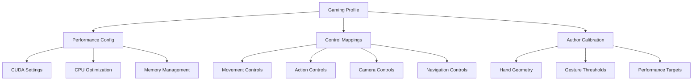

# Enhanced Configuration Management - CUDA Gaming System

## 🎮 Overview

The Enhanced A Hand For A Game system uses a sophisticated multi-tier configuration management system that handles everything from basic gesture controls to advanced CUDA performance optimization. The system is designed for maximum gaming performance with author-specific calibration.

## 🚀 Enhanced Configuration Architecture

### **Primary Configuration Files**
```
config/
├── controls.json           # 🎮 Gaming control mappings
├── performance.json        # ⚡ CUDA performance settings  
├── author_calibration.json # 🎯 stdnt-c1's hand calibration
└── gaming_profiles.json    # 🕹️ Game-specific configurations
```

### **Configuration Hierarchy**


## 🎯 Enhanced Gaming Configuration

### **Gaming Performance Profiles**
```json
{
  "gaming_profiles": {
    "competitive": {
      "priority": "LATENCY",
      "target_fps": 30,
      "latency_target": 35,
      "cuda_optimization": "MAXIMUM",
      "gesture_confidence": 0.85,
      "stability_frames": 2,
      "anti_spam_cooldown": 35
    },
    "precision": {
      "priority": "ACCURACY", 
      "target_fps": 25,
      "latency_target": 50,
      "cuda_optimization": "BALANCED",
      "gesture_confidence": 0.98,
      "stability_frames": 4,
      "noise_filtering": true
    },
    "performance": {
      "priority": "SPEED",
      "target_fps": 30,
      "latency_target": 45,
      "cuda_optimization": "MAXIMUM",
      "thermal_management": true,
      "adaptive_scaling": true
    }
  }
}
```

### **Enhanced Control Configuration**
```json
{
  "gesture_controls": {
    "MovementControl": {
      "enabled": true,
      "priority": "HIGH",
      "cuda_accelerated": true,
      "gestures": [
        {
          "name": "FORWARD",
          "enabled": true,
          "output_key": "KEY_W",
          "confidence_threshold": 0.92,
          "author_calibrated": true,
          "gaming_optimized": true
        }
      ]
    },
    "ActionControl": {
      "enabled": true,
      "priority": "CRITICAL",
      "cuda_accelerated": true,
      "anti_spam_protection": true,
      "gestures": [
        {
          "name": "PRIMARY_ATTACK",
          "gesture_type": "OK_SIGN",
          "output_action": "LEFT_MOUSE",
          "cooldown_ms": 50,
          "burst_protection": true
        }
      ]
    }
  }
}
```

## ⚡ CUDA Performance Configuration

### **CUDA Optimization Settings**
```json
{
  "cuda_settings": {
    "enabled": true,
    "device_id": 0,
    "memory_pool_size": "2GB",
    "stream_count": 4,
    "kernel_optimization": "GAMING",
    "adaptive_quality": {
      "enabled": true,
      "min_scale_level": 1,
      "max_scale_level": 4,
      "thermal_threshold": 85,
      "performance_threshold": 0.8
    }
  }
}
```

### **Performance Monitoring Configuration**
```json
{
  "performance_monitoring": {
    "enabled": true,
    "metrics_collection": "REAL_TIME",
    "warning_thresholds": {
      "fps_min": 25,
      "latency_max": 60,
      "cpu_usage_max": 85,
      "gpu_usage_max": 95,
      "memory_usage_max": 80
    },
    "adaptive_actions": {
      "reduce_quality_on_thermal": true,
      "enable_frame_skip_on_cpu_load": true,
      "clear_cache_on_memory_pressure": true
    }
  }
}
```

## 🎯 Author-Specific Calibration (stdnt-c1)

### **Hand Anatomy Configuration**
```json
{
  "author_calibration": {
    "hand_geometry": {
      "palm_ratio": 0.82,
      "finger_length_ratio": 1.45,
      "thumb_extension_angle": 42.5,
      "gesture_scale_factor": 1.08
    },
    "performance_targets": {
      "accuracy_threshold": 0.97,
      "processing_time_target": 33.3,
      "gesture_stability_frames": 3
    },
    "hardware_profile": {
      "cpu": "Intel i7-12700F",
      "gpu": "NVIDIA RTX 3070",
      "memory": "32GB DDR4-3200",
      "camera": "USB 3.0 1080p"
    }
  }
}
```

## 🛠️ Enhanced Management Commands

### **Basic Configuration Management**
```bash
# Enhanced status display
python config_manager.py status --detailed

# Gaming profile management
python config_manager.py profile competitive
python config_manager.py profile precision
python config_manager.py profile performance

# CUDA configuration
python config_manager.py cuda enable
python config_manager.py cuda optimize-for-gaming
python config_manager.py cuda thermal-protection on
```

### **Performance Optimization Commands**
```bash
# Performance tuning
python config_manager.py performance auto-optimize
python config_manager.py performance set-target-fps 30
python config_manager.py performance cuda-memory 2GB

# Author calibration
python config_manager.py calibration load-author-profile
python config_manager.py calibration verify-hand-geometry
python config_manager.py calibration benchmark-performance
```

### **Gaming-Specific Commands**
```bash
# Quick gaming setups
python config_manager.py gaming fps-mode      # Maximum FPS priority
python config_manager.py gaming latency-mode  # Minimum latency priority
python config_manager.py gaming balanced-mode # Balanced performance

# Control fine-tuning
python config_manager.py gesture set-confidence OK_SIGN 0.85
python config_manager.py gesture set-cooldown PRIMARY_ATTACK 35
python config_manager.py gesture enable-burst-protection
```

## 📊 Real-Time Configuration Monitoring

### **Live Configuration Dashboard**
```python
# Access real-time configuration status
from src.core.config_manager import ConfigManager

config = ConfigManager()
status = config.get_live_status()

print(f"""
🎮 GAMING CONFIGURATION STATUS
━━━━━━━━━━━━━━━━━━━━━━━━━━━━━━━━
🚀 Profile: {status.gaming_profile}
⚡ CUDA: {'Enabled' if status.cuda_enabled else 'Disabled'}
🎯 Target FPS: {status.target_fps}
⏱️  Latency Target: {status.latency_target}ms
🖥️  GPU Optimization: {status.gpu_optimization}
📊 Performance Mode: {status.performance_mode}
✅ Author Calibration: {'Active' if status.author_calibration else 'Inactive'}
""")
```

### **Configuration Auto-Adaptation**
```python
class AdaptiveConfig:
    def monitor_and_adapt(self):
        if self.current_fps < self.target_fps * 0.8:
            self.reduce_quality_temporarily()
        
        if self.gpu_temperature > 85:
            self.enable_thermal_protection()
        
        if self.gesture_accuracy < 0.95:
            self.increase_stability_frames()
        
        if self.system_lag_detected():
            self.switch_to_performance_mode()
```

## 🎮 Game-Specific Configurations

### **Popular Game Profiles**
```json
{
  "game_profiles": {
    "fps_games": {
      "priority": "LATENCY",
      "mouse_sensitivity": "HIGH",
      "action_controls": "ENABLED",
      "movement_precision": "MEDIUM"
    },
    "mmo_games": {
      "priority": "ACCURACY",
      "navigation_controls": "ENABLED", 
      "action_controls": "ENABLED",
      "camera_controls": "ENABLED"
    },
    "strategy_games": {
      "priority": "PRECISION",
      "camera_controls": "PRIMARY",
      "navigation_controls": "ENABLED",
      "gesture_confirmation": "STRICT"
    }
  }
}
```

## 🔧 Advanced Configuration Features

### **1. Dynamic Configuration Reload**
```python
# Hot-reload configuration without restart
config_manager.reload_configuration()
config_manager.apply_gaming_profile("competitive")
```

### **2. Configuration Validation**
```python
# Comprehensive configuration validation
validation_result = config_manager.validate_configuration()
if validation_result.has_errors():
    config_manager.fix_configuration_errors()
```

### **3. Performance-Based Auto-Tuning**
```python
# Automatic optimization based on system performance
auto_tuner = PerformanceAutoTuner()
optimal_config = auto_tuner.generate_optimal_config(
    system_specs=get_system_specs(),
    target_performance=get_performance_targets()
)
```

## 🛡️ Configuration Safety & Backup

### **Configuration Backup System**
```bash
# Automatic backups before changes
python config_manager.py backup create
python config_manager.py backup restore latest
python config_manager.py backup list

# Export/Import configurations
python config_manager.py export gaming-config.json
python config_manager.py import gaming-config.json
```

### **Fail-Safe Configuration**
```json
{
  "fail_safe_settings": {
    "emergency_fallback": {
      "disable_cuda_on_error": true,
      "reduce_to_basic_controls": true,
      "enable_cpu_only_mode": true,
      "lower_fps_target": 15
    },
    "recovery_actions": {
      "auto_restart_on_crash": true,
      "reset_to_default_on_corruption": true,
      "enable_safe_mode": true
    }
  }
}
```

## 🎯 Configuration Best Practices

### **Gaming Setup Workflow**
1. **🎮 Choose Gaming Profile**: Based on game type and hardware
2. **⚡ Verify CUDA Settings**: Ensure GPU acceleration is optimal
3. **🎯 Load Author Calibration**: Use stdnt-c1's hand-specific settings
4. **📊 Monitor Performance**: Watch real-time metrics
5. **🔧 Fine-Tune**: Adjust based on actual gaming performance

### **Performance Optimization Checklist**
- [ ] Gaming profile selected and active
- [ ] CUDA acceleration enabled and verified
- [ ] Author calibration loaded
- [ ] Performance targets configured
- [ ] Real-time monitoring enabled
- [ ] Fail-safe settings configured
- [ ] Configuration backup created

---

<div align="center">

**🎮 Enhanced Configuration Management System 🎮**

*Dynamic, performance-optimized, gaming-ready configuration*

**Built for maximum customization and peak gaming performance**

</div>
