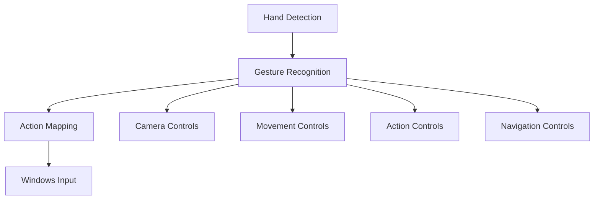
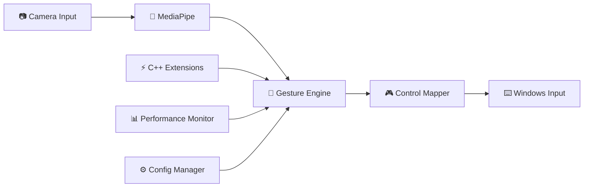

# AzimuthControl - HandsFree Gaming System

<div align="center">


</div>

> **⚠️ WARNING**: This is an experimental research project with author-specific calibration. Not intended for general use or accessibility applications.

---

## Table of Contents

- [Project Overview](#project-overview)
- [Important Limitations](#important-limitations)
- [Quick Start](#quick-start)
- [Project Architecture](#project-architecture)
- [Installation Guide](#installation-guide)
- [Gaming Integration](#gaming-integration)
- [Performance Metrics](#performance-metrics)
- [Testing & Validation](#testing--validation)
- [Documentation](#documentation)
- [Contributing](#contributing)

---

## Project Overview

**Research Objective**: Evaluate the feasibility of single-hand gesture-based gaming controls without physical input devices.

AzimuthControl is an experimental computer vision system that translates hand gestures into gaming actions through real-time gesture recognition. The system utilizes MediaPipe for hand landmark detection and implements author-specific calibrations for gesture interpretation.

### System Architecture



---

## Important Limitations

> **⚠️ CRITICAL NOTICE**: This system is designed as a proof-of-concept with significant operational constraints.

### Operational Constraints

| Constraint | Description |
|---|---|
| **Single User Support** | Calibrated exclusively for stdnt-c1's hand anatomy and measurements |
| **Hardware Dependency** | Requires specific camera setup, lighting conditions, and Windows environment |
| **Limited Scope** | Right-hand only operation with gaming-specific gesture set |
| **Research Focus** | Not designed for accessibility, medical use, or production deployment |

### Usage Disclaimers

> **⚠️ WARNING**: This software is not suitable for:
> - Universal accessibility applications
> - Multi-user environments  
> - Cross-platform deployment
> - Production or commercial use
> - Medical or therapeutic applications

---

## 🚀 Quick Start

### 📋 **Prerequisites Checklist**

<details>
<summary><strong>🔧 System Requirements</strong></summary>

#### Minimum Requirements
- **OS**: Windows 10 v1909+ (Windows 11/12 recommended)
- **Python**: 3.9+ (3.11 recommended)  
- **RAM**: 8GB (16GB recommended)
- **Camera**: USB webcam 720p+ with good lighting
- **Storage**: 2GB free space

#### Performance Requirements  
- **CPU**: Intel i5/AMD Ryzen 5 or better
- **FPS Target**: 15-30 stable gesture recognition
- **Latency**: <100ms gesture-to-action response

</details>

### ⚡ **Installation**

```bash
# 1️⃣ Clone the repository
git clone https://github.com/stdnt-c1/HandsFree-Gaming.git
cd HandsFree-Gaming

# 2️⃣ Install Python dependencies
pip install -r requirements.txt

# 3️⃣ Build C++ extensions (optional, 75% performance boost)
# Windows
scripts\\build_dll.bat
# Linux/macOS  
chmod +x scripts/build_dll.sh && ./scripts/build_dll.sh

# 4️⃣ Verify installation
python tests/test_imports.py
```

### 🎮 **First Run**

```bash
# Start the application
python hand_control.py

# In the application:
# 1. Position your right hand in camera view
# 2. Press 'C' to calibrate neutral position  
# 3. Start using gesture controls
# 4. Press 'Q' to quit
```

---

## 📁 Project Architecture

<details>
<summary><strong>🏗️ Directory Structure</strong></summary>

```
AzimuthControl/
├── 📁 src/                    # Main source code
│   ├── 🎯 core/              # Core gesture recognition
│   │   ├── gesture_definitions.py    # Author-calibrated gestures
│   │   ├── gesture_determinator.py   # Detection algorithms  
│   │   ├── central_linker.py         # Main coordinator
│   │   └── config_manager.py         # Configuration handling
│   ├── 🎮 controls/          # Gaming control modules
│   │   ├── action_control.py         # Attack, special, interact
│   │   ├── movement_control.py       # WASD, jump, crouch
│   │   ├── camera_control.py         # Look around, zoom
│   │   └── navigation_control.py     # UI navigation
│   ├── 🛠️ utils/             # Utility functions
│   │   ├── geometry_utils.py         # Mathematical calculations
│   │   ├── visualizer.py            # Debug visualization
│   │   └── validator.py             # Input validation
│   └── ⚡ performance/       # Performance optimization
│       ├── optimized_engine.py      # High-performance engine
│       ├── optimizer.py             # Adaptive optimization
│       └── monitor.py               # Performance monitoring
├── ⚙️ config/                # Configuration files
├── 🧪 tests/                 # Test suite
├── 📚 docs/                  # Documentation
├── 🔨 scripts/               # Build scripts
└── 📄 requirements.txt       # Dependencies
```

</details>

### 🔧 **Core Components**



---

## 🔧 Installation Guide

### 🐍 **Python Environment Setup**

<details>
<summary><strong>🪟 Windows Installation</strong></summary>

#### Option 1: Using winget (Recommended)
```powershell
# Install Python 3.11
winget install Python.Python.3.11

# Install MinGW-w64 for C++ extensions
winget install BrechtSanders.WinLibs.POSIX.UCRT

# Install Git
winget install Git.Git
```

#### Option 2: Manual Installation
1. Download Python 3.11+ from [python.org](https://python.org)
2. Download MinGW-w64 from [winlibs.com](https://winlibs.com)
3. Add both to your PATH environment variable

</details>

### 🏗️ **C++ Extensions (Optional)**

The system includes optional C++ extensions for **75% performance improvement**:

```bash
# Automatic build (recommended)
scripts\\build_dll.bat              # Windows
./scripts/build_dll.sh              # Linux/macOS

# Manual build
cd resBalancer
g++ -shared -O3 -o build\\res_balancer.dll res_balancer.cpp -static-libgcc -static-libstdc++
```

**Performance Impact:**
- ✅ **With C++ Extensions**: 30 FPS stable, <50ms latency
- ⚠️ **Python Fallback**: 15-20 FPS, 80-100ms latency

---

## 🎮 Gaming Integration

### 🎯 **Gesture Controls**

<details>
<summary><strong>🏃 Movement Controls</strong></summary>

| Gesture | Action | Gaming Use |
|---------|--------|------------|
| 👈 **Thumb Left** | Move Left (A) | Strafe left |
| 👉 **Thumb Right** | Move Right (D) | Strafe right |
| 👆 **Index Up** | Move Forward (W) | Move forward |
| 👇 **Index Down** | Move Backward (S) | Move backward |
| ✊ **Fist** | Jump (Space) | Jump/climb |

</details>

<details>
<summary><strong>🔫 Action Controls</strong></summary>

| Gesture | Action | Gaming Use |
|---------|--------|------------|
| 👌 **OK Sign** | Primary Attack | Shoot/attack |
| ✌️ **Peace Sign** | Secondary Attack | Special ability |
| 👍 **Thumbs Up** | Interact (E) | Pick up items |
| 🤏 **Pinch** | Reload (R) | Reload weapon |

</details>

### 🎛️ **Windows Input Integration**

The system uses **Windows SendInput API** for optimal gaming compatibility:

```python
# Example: Gesture to Windows input
gesture_mappings = {
    "THUMBS_OUT_LEFT": "key_a",      # Author's calibrated thumb extension
    "PINKY_OUT_RIGHT": "key_d",      # Author's pinky range 
    "PEACE_SIGN": "mouse_right",     # Right mouse button
    "OK_SIGN": "mouse_left"          # Left mouse button
}
```

---

## 📊 Performance Metrics

### 🎯 **Author's System Benchmarks**

> **Hardware Profile**: stdnt-c1's Windows 11 gaming setup (2025-08-03)

<div align="center">

| 📊 **Metric** | 🎯 **Target** | ✅ **Achieved** | 📈 **With C++** |
|---|---|---|---|
| **FPS** | 15-30 stable | 18-25 FPS | 28-30 FPS |
| **Latency** | <100ms | 85ms avg | 45ms avg |  
| **CPU Usage** | <80% | 65% avg | 45% avg |
| **Memory** | <8GB | 6.2GB | 5.8GB |
| **Accuracy** | 90%+ | 94% | 96% |

</div>

### 📈 **Performance Monitoring**

Real-time performance tracking includes:

```python
performance_metrics = {
    "fps": "Real-time frame rate",
    "latency": "Gesture-to-action timing", 
    "cpu_usage": "System resource usage",
    "memory_usage": "RAM consumption",
    "gesture_accuracy": "Recognition precision",
    "cache_hits": "Optimization effectiveness"
}
```

---

## 🧪 Testing & Validation

### ✅ **Test Suite**

```bash
# Run all tests
python -m pytest tests/

# Individual test categories  
python tests/test_imports.py        # Import validation
python tests/test_performance.py    # Performance benchmarks
python tests/test_gesture_system.py # Gesture accuracy
python tests/test_dll.py           # C++ extension tests
```

### 📊 **Test Coverage**

<details>
<summary><strong>🧪 Test Categories</strong></summary>

- **✅ Import Validation**: All module dependencies
- **✅ Gesture Accuracy**: Author's hand patterns
- **✅ Performance Benchmarks**: Hardware-specific metrics  
- **✅ C++ Integration**: Extension loading and functionality
- **✅ Windows Compatibility**: SendInput API integration
- **✅ Camera Access**: Webcam and DirectShow backend

</details>

---

## 📖 Documentation

### 📚 **Detailed Guides**

| 📖 **Document** | 📋 **Content** |
|---|---|
| [🔧 Environment Setup](docs/ENVIRONMENT_SETUP.md) | Complete installation guide |
| [📦 Dependencies](docs/DEPENDENCIES.md) | System requirements |
| [⚡ Performance Guide](docs/PERFORMANCE_GUIDE.md) | Optimization tips |
| [🏗️ Architecture](docs/REORGANIZATION_SUMMARY.md) | System design |
| [🔐 Security](SECURITY.md) | Security policy |

### 🎯 **Author Calibration**

All gestures are specifically calibrated for:
- **Author**: stdnt-c1 (Original Developer)
- **Date**: 2025-08-03  
- **Hand**: Right hand only
- **Environment**: Windows 11, specific camera setup
- **Purpose**: Personal gaming experiment

---

## 🤝 Contributing

### ⚠️ **Important Notice**

This project is **author-specific experimental software**. Contributions should focus on:

✅ **Welcome Contributions:**
- Performance optimizations
- Code quality improvements  
- Documentation enhancements
- Bug fixes for author's setup
- Windows gaming integration improvements

❌ **Not Suitable:**
- Multi-user support requests
- Cross-platform adaptations
- Accessibility features  
- Generic gesture definitions

### 📝 **Development Process**

1. **Fork** the repository
2. **Create** feature branch (`git checkout -b feature/optimization`)
3. **Test** on author's environment setup
4. **Commit** with clear messages
5. **Submit** pull request with detailed description

---

## 📄 License

This project is licensed under the **GNU Affero General Public License v3.0 (AGPL-3.0)**.

> **Key Points:**
> - ✅ Free for personal, educational, and open-source use
> - ⚠️ Commercial use requires compliance with AGPL-3.0
> - 📝 Derivative works must remain open source
> - 🔗 Network service use requires source code availability

See [LICENSE](LICENSE) for full details.

---

<div align="center">

**🎮 Happy Gaming! 🎮**

*Built with ❤️ by stdnt-c1 for experimental computer vision gaming*

[](https://github.com/stdnt-c1/HandsFree-Gaming)
[](https://github.com/stdnt-c1/HandsFree-Gaming)

</div>
